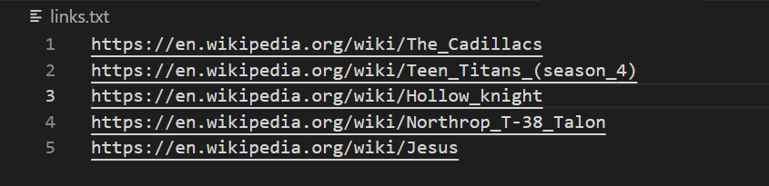
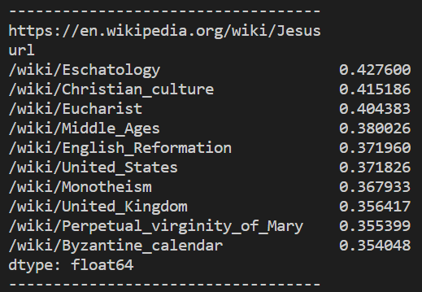

## The general task is to create a system that will recommend similar articles based on the previously visited articles

### Project contains 3 main modules:

#### 1. Scraper

Module to scrape Wikipedia in search of "random" articles following dfs like movement and downloading it's content. It then is able to tokenize paragraphs of text into tokens and save dataframe of links wiht their tokens mapped to them

#### 2. Ranker

Module using tokenized dataframe created by scraper to create rankings based on TF-IDF with avaraging sublinear and linear TF to retrieve 10 best matches for a given document

#### 3. LinkLoader

Simple module loading links.txt file with links from wikipedia to find closest articles saved in dataframe

### Execution

- Put desired links seperated by new line character into links.txt file in main directory as shown on example below  
  
- Run main.py and get result printed out on console  
  
- If data.csv is not yet created execution of a program might take a while, but after that generating rating is much faster

### Scraped data

DataVisualize notebook shows briefly some facts about downloaded data
